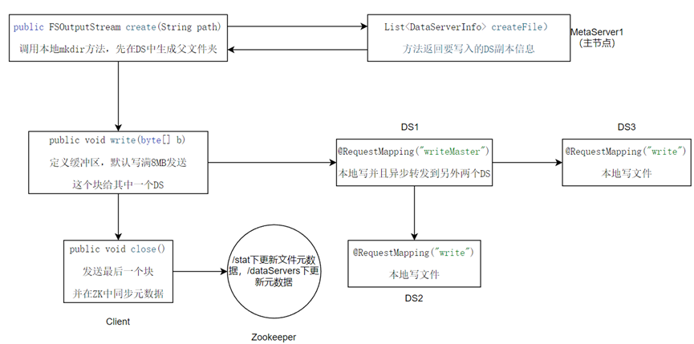

## **动手实现一个拥有最基础的文件操作的分布式文件存储系统**

1.  支持文件创建(create、createDirectory)、查看属性信息(listStatus，getStatus)、删除(delete)
2.  支持文件open
3.  支持文件的write
4.  支持文件read
5.  获取集群信息（主节点信息，从节点信息）
6.  采用http 协议模拟以上文件操作功能
7.  要求按照文件元数据、内容数据的方式存储设计实现，元数据的定义为包含文件的基本信息如文件名、大小、创建、修改时间、内容数据的三副本索引等，内容数据为实际文件内所存储的内容信息
8.  元数据服务高可用，元数据的操作支持分布式的一致性
9.  文件内容数据，支持3副本写（强一致写）、随机一个副本读（实现读写一致性）
10. 3副本分布可支持合理分区，消除热点
11. 可以主动发现文件副本不足隐患，同时可以自我修复补足不足3副本的数据。
12. 集群规模最小为两个metaServer，一主一从（默认），四个dataserver，保证三副本写。
<!----><!---->
### **项目运行起来后Zookeepr节点说明：**

1.  /metaServers:此节点下保存已经注册了的metaServer元数据信息。此节点下创建的节点都是临时节点，实现服务动态上下线。mataServer服务监听这个节点下的子节点，如果子节点不存在就重新注册。
2.  /dataServers:此节点下保存已经注册了的dataServer元数据信息。此节点下创建的节点都是临时节点，实现服务动态上下线。dataServer服务监听这个节点下的子节点，如果子节点不存在就重新注册。
3.  /SynDataServers：此节点下保存的都是永久节点，如果dataServer或者metaServer掉线后重新注册时候会把本节点下对应子节点内容复制到自己的工作节点（/dataServers）下。每次执行完写文件，删除文件之后会执行同步方法把最新的副本保存在这个节点下。
4.  /lock\_path：此节点不保存任何信息，为定时扫描恢复功能添加分布式锁，多个metaServer执行的时候互斥执行。防止两个线程对zk中元数据产生冲突。
5.  /stat：此节点下为分布式存储系统的文件元数据信息，通过客户端client创建的文件或者文件夹都在此目录下有对应文件元数据。

### 功能一：创建文件夹流程图解：

### 功能二：写文件流程图解：

### 功能三：删除文件流程图解：

### 功能四：读文件流程图解：

### 功能五：定时全盘扫描文件，修复副本不足。其中fsckTask实现分布式锁，避免多个MS同时执行修复功能导致共享数据冲突。执行过程如下：

    @Scheduled(fixedRate = 1*60*1000) // 每隔 30 分钟执行一次  30*60*1000
    public void fsckTask() {
        //todo 因为有多个MetaServer（MS）实例在并行运行相同的定时任务时，会导致冲突和数据不一致的问题。使用分布式锁解决
        CuratorFramework cf = zkUtil.getCuratorFramework();
        InterProcessMutex lock = new InterProcessMutex(cf, "/lock_path");
        try {
            //调用试图获取一个分布式锁，并且允许最多等待30秒来获取这个锁。
            if (lock.acquire(30, TimeUnit.SECONDS)) {
                try {
                    // 恢复任务
                    runFsckTask();
                } finally {
                    //释放锁
                    lock.release();
                }
            }
        } catch (Exception e) {throw new RuntimeException(e);}
    }

*   1.全量扫描文件列表，List\<StatInfo> files = scanAllFiles(cf,"/stat");

*   2.检查文件副本数量是否正常,不正常就要去zk更新文件副本数：3副本、2副本、单副本，根据所有文件去检查磁盘是否存在，然后更新ZK中文件元数据和DS元数据。

*   3.恢复文件，如果恢复成功还要去更新zk中元数据。

### 功能六：getFileStats，listFileStats和getClusterInfo方法都直接去metaServer中查zk中获取就行了。

## 各模块说明
 1. bin：项目一键启动脚本，用于编译完成后，上传至服务器上，可以将minFS服务整体启动起来
 2. dataServer:主要提供数据内容存储服务能力，单节点无状态设计，可以横向扩容
 3. metaServer:主要提供文件系统全局元数据管理，管理dataserver的负载均衡，主备模式运行
 4. easyClient:一个功能逻辑简单的SDK，用来与metaServer、dataServer通信，完成文件数据操作

## linux上启动项目：
1. 先git clone 把项目克隆到本地
2. cd进入项目根目录下  mvn clean package
3. 然后执行   . /workpublish/bin/start.sh localhost:2181   一键启动项目，后面ip：port为你的zookeeper地址，
4. 客户端操作，去/workpublish/easyClient下拿到jar包，为客户端jar包。导入到你的测试项目中。
5. 所有操作都在EfileSystem这个类中操作。

一、以下演示把一个文件写到分布式系统中。

    //1.先创建File，路径为想要写入的文件
    File file=new File("src/main/java/org/example/test/1.jpg");
    FileInputStream fis=new FileInputStream(file);
    //2.创建eFileSystem，传入一个盘符fileSystem，创建文件都在这个目录下创建三副本信息。不传默认在项目目录下创建dataServerDiskSpace文件夹
    EFileSystem eFileSystem=new EFileSystem();
    //3.得到一个分布式输出流，传入一个路径，总实际路径为拼接每个dataServer的服务名
    // /root/javaproject/minfs_student/dataServerDiskSpace/ds1/a/one.jpg
    // /root/javaproject/minfs_student/dataServerDiskSpace/ds2/a/one.jpg
    // /root/javaproject/minfs_student/dataServerDiskSpace/ds3/a/one.jpg
    FSOutputStream fsOutputStream = eFileSystem.create("/a/one.jpg");
    //4.创建缓冲区
    byte[] buffer=new byte[1024];
    int len = fis.read(buffer);
    while(len!=-1){
        //5.写到分布式系统中。
        fsOutputStream.write(buffer,0,len);
        len=fis.read(buffer);
    }
    fis.close();
    //5.关闭分布式输出流
    fsOutputStream.close();
    

二、创建文件夹

    EFileSystem eFileSystem=new EFileSystem();
    boolean mkdir = eFileSystem.mkdir("/a/mkdir/newdir");
    System.out.println(mkdir);

三、获取DataServer元数据信息

    EFileSystem eFileSystem=new EFileSystem();
    ClusterInfo clusterInfo = eFileSystem.getClusterInfo();
    System.out.println("获取ds四节点元数据如下：");
    System.out.println(clusterInfo);
    System.out.println();
    
四、列出当前文件夹下文件

    List<StatInfo> statInfos = eFileSystem.listFileStats("/a");
    statInfos.stream().forEach(System.out::println);
    System.out.println();

五、获取当前文件元数据

    StatInfo fileStats = eFileSystem.getFileStats("/a");
    System.out.println(fileStats);

六、删除文件

    EFileSystem eFileSystem=new EFileSystem();
    boolean delete = eFileSystem.delete("/needdelete.jpg");
    System.out.println("删除/needdelete.jpg文件是否成功："+delete);
    
七、读取文件到本地

    File file=new File("src/main/java/org/example/test/copy.txt");
    FileOutputStream fos = new FileOutputStream(file,false);//是否追加
    EFileSystem eFileSystem=new EFileSystem();
    //找到对应的副本信息
    FSInputStream fis = eFileSystem.open("/a/hello.txt");
    byte[] buffer=new byte[4];
    int len = fis.read(buffer);
    while (len!=-1){
    fos.write(buffer,0,len);
    len = fis.read(buffer);
    }
    fis.close();
    fos.close();

